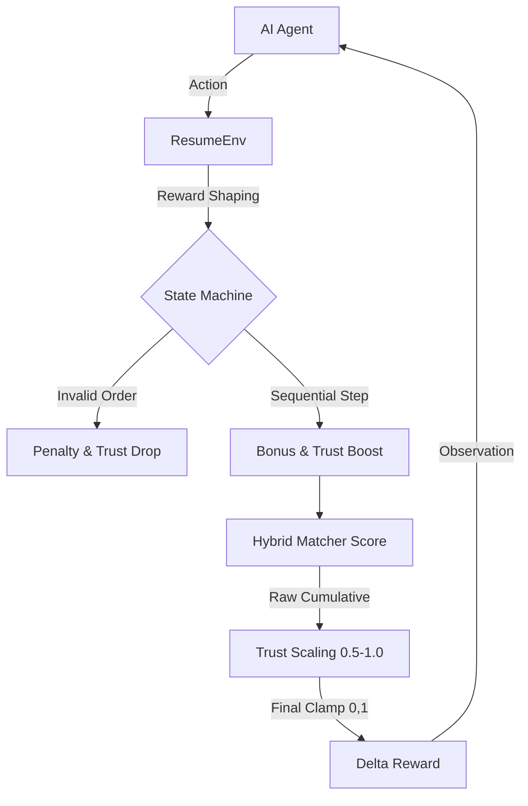

# 🏢 OpenEnv-Compliant Resume-Job Matching Environment

A strictly OpenEnv-compliant real-world simulation environment for Job and Resume Matching, featuring CorpSeQL-inspired **Trust-Based Scaling**.

## Architecture Overview 🛠️

## Environment Description 🧠
The `resume-matching-env` simulates the high-stakes reasoning chain of an HR AI assistant. Unlike standard one-shot vector search, this environment enforces a **Stateful Reasoning workflow** to evaluate if agents can maintain consistency across multiple logical turns.

## 🔁 Multi-Step Reasoning Workflow
Agents must navigate the following transitions. Skipping steps or taking erratic actions triggers **Behavioral Penalties**:

1.  **Analyze (`analyze_job`)**: Review the job requirements and constraints.
2.  **Shortlist (`shortlist`)**: Filter the candidate pool into a semantic subset.
3.  **Rank (`rank`)**: Order the shortlist by deep contextual relevance.
4.  **Finalize (`finalize`)**: Commit final matches or rankings.

## 🎯 Advanced Reward Engineering (Trust Score)
The system uses a **CorpSeQL-style Trust-Based Reward Model**:
- **Trust Multiplier**: Calculated between `0.5` and `1.0`.
- **Scaling Phase**: `Final Reward = Cumulative Raw * Trust Score`.
- **Behavioral Update**: Trust increases on consecutive logical steps and decreases on invalid transitions or skipping.
- **Normalization**: All final rewards are strictly clamped to the `[0.0, 1.0]` range for OpenEnv compliance.

## Action & Observation Spaces

### Observation Space
The observation space is a Pydantic model (`Observation`) containing:
- `resumes`: Full candidate vector database.
- `jobs`: Target job definitions.
- `shortlisted_resumes`: State of the current shortlist.
- `trust_score`: Real-time decision quality multiplier.
- `current_step_name`: The logical step expected by the environment.

### Action Space
The action space is a Pydantic model (`Action`) containing:
- `action_type`: `analyze_job`, `shortlist`, `rank`, or `finalize`.
- `matches`: `{job_id: resume_id}` dictionary for batch assignments.
- `ranked_list`: Ordered list of `resume_id`s for ranking tasks.

## 📊 Benchmark Metrics
This environment delivers three difficulty levels to stress-test LLM reasoning:
- **Easy**: 1 Job vs N Resumes (Basic selection).
- **Medium**: 1 Job → Top 3 Ranked List (Semantic ordering).
- **Hard**: 5 Jobs Batch Allocation (Optimization and conflict resolution).

## Setup & Execution
- **Run Baseline**: `python baseline_agent.py` (Validation via deterministic matching)
- **Run AI Inference**: `python inference.py` (Evaluates LLM with silent fallback)
- **Open Dashboard**: `python app.py` (Visualizes Trust, Rewards, and Step-wise state)

---
**This environment is built for evaluating high-fidelity agents where reasoning consistency is as important as the final match.**
